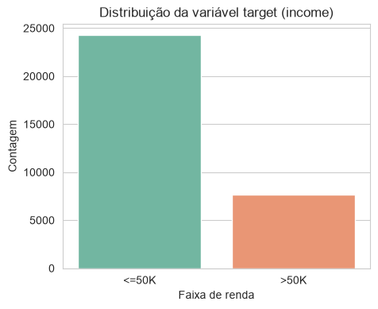
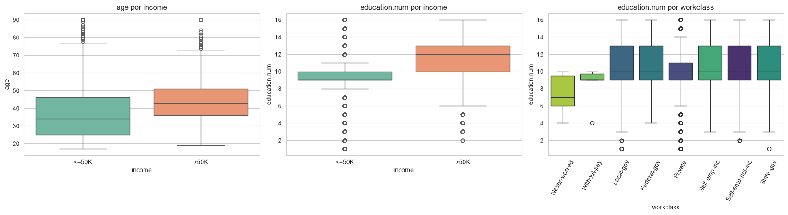
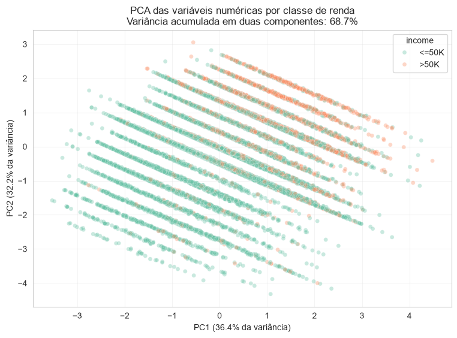

# Análise do Adult Income

Análise exploratória de dados e pipeline de pré-processamento do conjunto de dados Adult Income Census, com o objetivo de compreender os fatores associados a uma renda anual superior a US$ 50 mil. Este projeto investiga a qualidade dos dados, padrões demográficos e profissionais, desbalanceamento de classes e a separabilidade das faixas de renda, preparando o conjunto de dados para o desenvolvimento futuro de um modelo de classificação.

## Conjunto de dados

O projeto utiliza o [Adult Income Census](https://www.kaggle.com/datasets/anaghakp/adult-income-census).

A variável-alvo é `income`, dividida em duas classes:

* `<=50K`
* `>50K`

O conjunto de dados contém **31.947 registros**, **11 variáveis preditoras** e uma variável-alvo.

## Principais resultados encontrados

* Aproximadamente 76% dos registros pertencem à classe `<=50K`, indicando um desbalanceamento moderado entre as classes;
* O nível de escolaridade apresenta uma relação relevante com a renda: níveis mais elevados de formação possuem uma proporção maior de indivíduos com renda superior a US$ 50 mil;
* Os indivíduos da classe `>50K` tendem a ser mais velhos e a possuir mais anos de escolaridade;
* As variáveis `workclass`, `occupation` e `native.country` contêm valores ausentes;
* As variáveis numéricas, isoladamente, não separam claramente as duas faixas de renda;
* As duas primeiras componentes do PCA preservam aproximadamente 68,7% da variância das variáveis numéricas;
* O coeficiente de silhueta de 0,068 indica uma forte sobreposição entre as classes de renda na projeção do PCA.

## Visualizações Exploratórias

### Income distribution



### Income by education level



### PCA projection



## Pré-processamento dos dados

O pipeline de pré-processamento realiza:

* Imputação pela mediana para possíveis valores numéricos ausentes;
* Criação da categoria explícita `Unknown` para valores categóricos ausentes;
* Transformação logarítmica da variável `fnlwgt`
* Padronização com `StandardScaler`;
* One-hot encoding das variáveis nominais;
* PCA para redução da dimensionalidade das variáveis numéricas.

O pipeline foi implementado utilizando `Pipeline` e `ColumnTransformer`, evitando vazamento de dados entre os conjuntos de treino e teste.

## Tecnologias utilizadas

* Python
* Pandas
* NumPy
* Matplotlib
* Seaborn
* Scikit-learn
* Jupyter Notebook

## Estrutura do repositório

```text
.
├── data/
│   └── adult-income.csv
├── images/
│   ├── class-distribution.png
│   ├── income-by-education.png
│   └── pca-projection.png
├── adult-income-analysis.ipynb
├── requirements.txt
└── README.md
```

## Como executar o projeto

Clone o repositório:

```bash
git clone https://github.com/scalcogigi/machine-learning-adult-census-analysis.git
cd machine-learning-adult-census-analysis
```

Instale as dependências:

```bash
pip install -r requirements.txt
```

Em seguida, abra o notebook:

```bash
jupyter notebook adult-income-analysis.ipynb
```

O projeto também pode ser executado diretamente no Google Colab.

## Autoras

* Giovanna Barros Scalco
* Mariana Rocha Gomes
